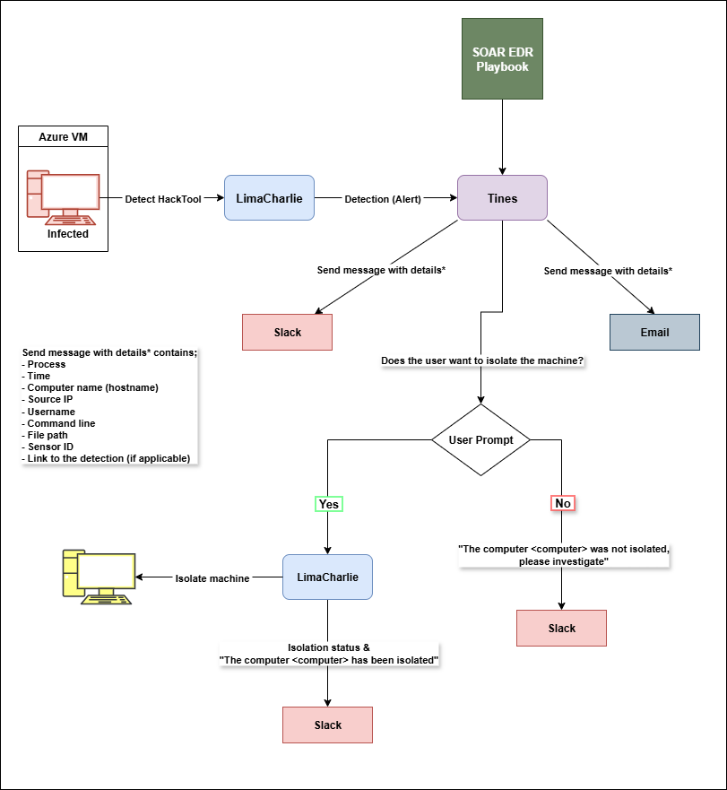

# Integration of SOAR and EDR featuring LimaCharlie and Tines


## Demo

### [Watch Demo on YouTube](https://youtu.be/yDLCiHlw-6Q)

---

## Summary

This GitHub project outlines the creation of a SOAR lab that integrates with an EDR tool to automate incident handling. The core idea is to build an automated workflow that detects, analyzes, and responds to security threats on an endpoint with minimal human intervention. This setup is designed to significantly reduce the manual workload for security teams and speed up the response to potential attacks.

The lab uses LimaCharlie as the EDR to monitor endpoints and detect threats, Tines as a no-code automation platform to orchestrate the response workflow, and Slack for sending real-time notifications. The project involves installing a LimaCharlie agent on a Windows Server, configuring detection rules for malicious activity (like credential dumping via LaZagne), and then using Tines to automate actions based on the alerts. For instance, when a threat is detected, the system can automatically send a detailed alert to a Slack channel and email or even take response actions like isolating the compromised machine from the network.

## Playbook workflow




## LaZagne - Windows security events

- Repo : [https://github.com/AlessandroZ/LaZagne](https://github.com/AlessandroZ/LaZagne)


## LimaCharlie config

### Installation

```bash
lc_sensor.exe -i YOUR_INSTALLATION_KEY
```

- Docs : [https://docs.limacharlie.io/docs](https://docs.limacharlie.io/docs)


### LimaCharlie D&R Rule

- Detect

```bash
events:
  - NEW_PROCESS
  - EXISTING_PROCESS
op: and
rules:
  - op: is windows
  - op: or
    rules:
    - case sensitive: false
      op: ends with
      path: event/FILE_PATH
      value: LaZagne.exe
    - case sensitive: false
      op: contains
      path: event/COMMAND_LINE
      value: LaZagne
    - case sensitive: false
      op: contains
      path: event/COMMAND_LINE
      value: ' all'
    - case sensitive: false
      op: is
      path: event/HASH
      value: 'dc06d62ee95062e714f2566c95b8edaabfd387023b1bf98a09078b84007d5268'
```

- Respond

```bash
- action: report
  name: detect-hacktool-lazagne
  metadata:
    author: Anon
    description: Detects the execution of LaZagne credential dumping tool via file path, command line, or file hash.
    falsepositives: 
      - Legitimate penetration testing tools named 'lazagne'
    level: high
    tags:
      - attack.credential_access
    name: HackTool - Lazagne
```

---

## Tines config

- Docs : [https://www.tines.com/docs](https://www.tines.com/docs)

### Slack, Email, User prompt message structure

```html
Detection Info.

Title : <<retrieve_detections.body.cat>>
Time : <<retrieve_detections.body.detect.routing.event_time>>
Computer : <<retrieve_detections.body.detect.routing.hostname>>
Source IP : <<retrieve_detections.body.detect.routing.ext_ip>>
Username : <<retrieve_detections.body.detect.event.USER_NAME>>
File Path : <<retrieve_detections.body.detect.event.FILE_PATH>>
Command Line : <<retrieve_detections.body.detect.event.COMMAND_LINE>>
Sensor ID : <<retrieve_detections.body.detect.routing.sid>>

Detection Link : <<retrieve_detections.body.link>>
```

### Tines Storybook


---

## Evidence

### Email alerts


### Slack channel alerts


